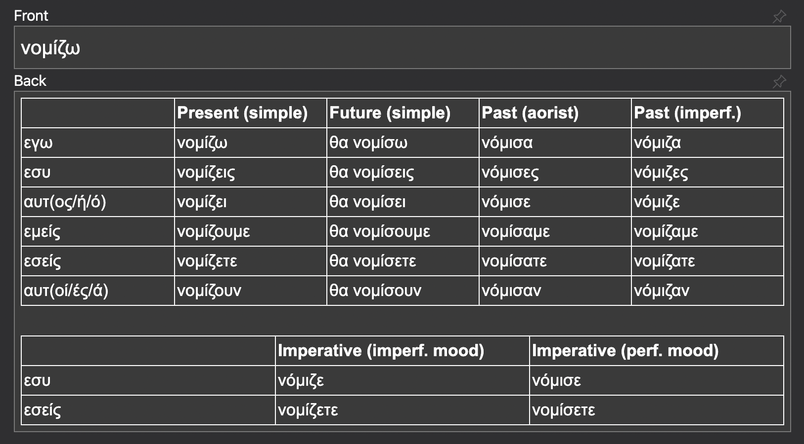

===========
greek-verbs
===========

Programmable interface to Cooljugator's Modern Greek verb database.

Installation
---------------

Prerequisites

- Python 3.6+
- ``pip``
- `Anki Table add-on <https://ankiweb.net/shared/info/1237621971>`_ (so Anki can render the table within the card correctly)
- (optional) ``virtualenvwrapper``

.. code-block:: bash

    git clone git@github.com:tsouchlarakis/greek-verbs.git
    rmvirtualenv greek-verbs  # Only if using virtualenvwrapper to manage virtualenvs
    mkvirtualenv greek-verbs
    workon greek-verbs
    cd greek-verbs
    pip install -r requirements.txt
    pip install -e .

Usage
-----

**Scrape the Cooljugator website for all Modern Greek verb conjugations**:

.. code-block:: bash

    $ greek-verbs scrape-conjugations --json-output-fpath ~/Desktop/verb_conjugations.json

**Show data for a given verb or verbs**:

.. code-block:: bash

    $ greek-verbs show --verb νομίζω  # Can add an arbitrary number of verbs with --verb verb2 --verb verb3 ...

    +----------------+---------------+-------------+----------------+
    | Present Simple | Future Simple | Past Aorist | Past Imperfect |
    +================+===============+=============+================+
    | νομίζω         | θα νομίσω     | νόμισα      | νόμιζα         |
    +----------------+---------------+-------------+----------------+
    | νομίζεις       | θα νομίσεις   | νόμισες     | νόμιζες        |
    +----------------+---------------+-------------+----------------+
    | νομίζει        | θα νομίσει    | νόμισε      | νόμιζε         |
    +----------------+---------------+-------------+----------------+
    | νομίζουμε      | θα νομίσουμε  | νομίσαμε    | νομίζαμε       |
    +----------------+---------------+-------------+----------------+
    | νομίζετε       | θα νομίσετε   | νομίσατε    | νομίζατε       |
    +----------------+---------------+-------------+----------------+
    | νομίζουν       | θα νομίσουν   | νόμισαν     | νόμιζαν        |
    +----------------+---------------+-------------+----------------+

    +------------------------------+----------------------------+
    | Imperative Imperfective Mood | Perfective Imperative Mood |
    +==============================+============================+
    | νόμιζε                       | νόμισε                     |
    +------------------------------+----------------------------+
    | νομίζετε                     | νομίσετε                   |
    +------------------------------+----------------------------+

    Ελλήνικα: ... # first example usage in Greek
    English: ... # second example usage in Greek

    ...more example usages

**Print necessary information to create an Anki flashcard for a given verb**:

.. code-block:: bash

    $ greek-verbs anki-flashcard --verb νομίζω
    νομίζω  <table class="table_class_basic_full_width" style="font-size: 85%; width: 100%; border-collapse: collapse; border: 1px solid;">
        <thead>
            <tr>
                <th style="width:20%; text-align:left; padding: 2px; border: 1px solid;">    </th>
                <th style="width:20%; text-align:left; padding: 2px; border: 1px solid;">Present (simple)</th>
                <th style="width:20%; text-align:left; padding: 2px; border: 1px solid;">Future (simple)</th>
                <th style="width:20%; text-align:left; padding: 2px; border: 1px solid;">Past (aorist)</th>
                <th style="width:20%; text-align:left; padding: 2px; border: 1px solid;">Past (imperf.)</th>
            </tr>
        </thead>
        <tbody>
            <tr>
                <td style="width: 20%; padding: 2px; border: 1px solid;">εγω</td>
                <td style="width: 20%; padding: 2px; border: 1px solid;">νομίζω</td>
                <td style="width: 20%; padding: 2px; border: 1px solid;">θα νομίσω</td>
                <td style="width: 20%; padding: 2px; border: 1px solid;">νόμισα</td>
                <td style="width: 20%; padding: 2px; border: 1px solid;">νόμιζα</td></tr><tr>
                <td style="width: 20%; padding: 2px; border: 1px solid;">εσυ</td>
                <td style="width: 20%; padding: 2px; border: 1px solid;">νομίζεις</td>
                <td style="width: 20%; padding: 2px; border: 1px solid;">θα νομίσεις</td>
                <td style="width: 20%; padding: 2px; border: 1px solid;">νόμισες</td>
                <td style="width: 20%; padding: 2px; border: 1px solid;">νόμιζες</td></tr><tr>
                <td style="width: 20%; padding: 2px; border: 1px solid;">αυτ(ος/ή/ό)</td>
                <td style="width: 20%; padding: 2px; border: 1px solid;">νομίζει</td>
                <td style="width: 20%; padding: 2px; border: 1px solid;">θα νομίσει</td>
                <td style="width: 20%; padding: 2px; border: 1px solid;">νόμισε</td>
                <td style="width: 20%; padding: 2px; border: 1px solid;">νόμιζε</td></tr><tr>
                <td style="width: 20%; padding: 2px; border: 1px solid;">εμείς</td>
                <td style="width: 20%; padding: 2px; border: 1px solid;">νομίζουμε</td>
                <td style="width: 20%; padding: 2px; border: 1px solid;">θα νομίσουμε</td>
                <td style="width: 20%; padding: 2px; border: 1px solid;">νομίσαμε</td>
                <td style="width: 20%; padding: 2px; border: 1px solid;">νομίζαμε</td></tr><tr>
                <td style="width: 20%; padding: 2px; border: 1px solid;">εσείς</td>
                <td style="width: 20%; padding: 2px; border: 1px solid;">νομίζετε</td>
                <td style="width: 20%; padding: 2px; border: 1px solid;">θα νομίσετε</td>
                <td style="width: 20%; padding: 2px; border: 1px solid;">νομίσατε</td>
                <td style="width: 20%; padding: 2px; border: 1px solid;">νομίζατε</td></tr><tr>
                <td style="width: 20%; padding: 2px; border: 1px solid;">αυτ(οί/ές/ά)</td>
                <td style="width: 20%; padding: 2px; border: 1px solid;">νομίζουν</td>
                <td style="width: 20%; padding: 2px; border: 1px solid;">θα νομίσουν</td>
                <td style="width: 20%; padding: 2px; border: 1px solid;">νόμισαν</td>
                <td style="width: 20%; padding: 2px; border: 1px solid;">νόμιζαν</td>
            </tr>
        </tbody>
    </table>
     
    <table class="table_class_basic_full_width" style="font-size: 85%; width: 100%; border-collapse: collapse; border: 1px solid;">
        <thead>
            <tr>
                <th style="width:33%; text-align:left; padding: 2px; border: 1px solid;">    </th>

                <th style="width:33%; text-align:left; padding: 2px; border: 1px solid;">Imperative (imperf. mood)</th>
                <th style="width:33%; text-align:left; padding: 2px; border: 1px solid;">Imperative (perf. mood)</th>
            </tr>
        </thead>
        <tbody>
            <tr>
                <td style="width: 33%; padding: 2px; border: 1px solid;">εσυ</td>
                <td style="width: 33%; padding: 2px; border: 1px solid;">νόμιζε</td>
                <td style="width: 33%; padding: 2px; border: 1px solid;">νόμισε</td>
            </tr>
            <tr>
                <td style="width: 33%; padding: 2px; border: 1px solid;">εσείς</td>
                <td style="width: 33%; padding: 2px; border: 1px solid;">νομίζετε</td>
                <td style="width: 33%; padding: 2px; border: 1px solid;">νομίσετε</td>
            </tr>
        </tbody>

        ...plus another HTML table with sample usages and their English translations

When pasted into Anki, it'll look like this:

**Note**: Install the `Anki Table add-on <https://ankiweb.net/shared/info/1237621971>`_ so Anki can render the table within the card correctly.

Changelog
---------

See `changelog <CHANGELOG.rst>`_.

License
-------

See `license <LICENSE>`_.
